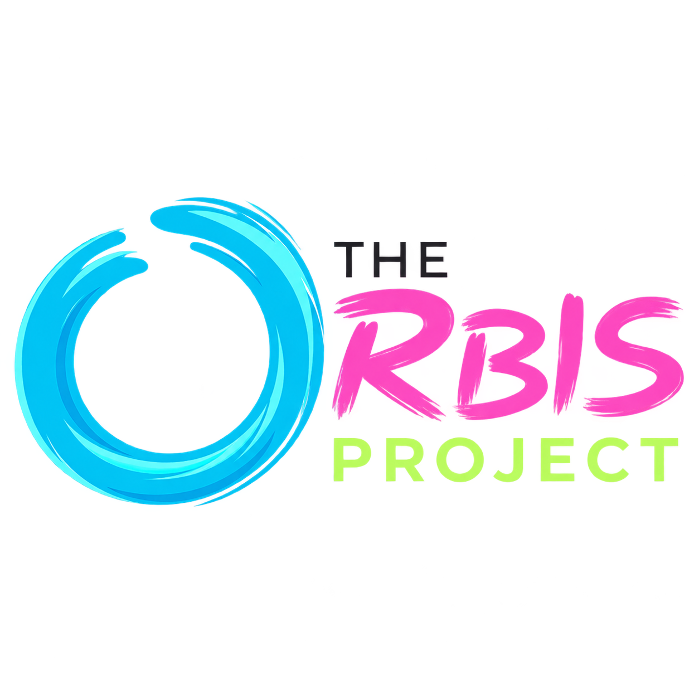
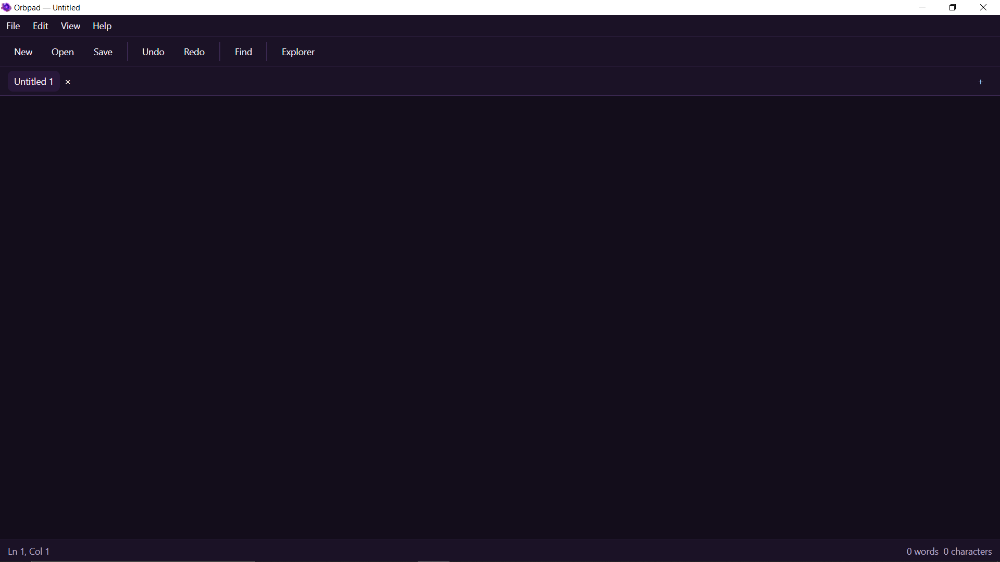
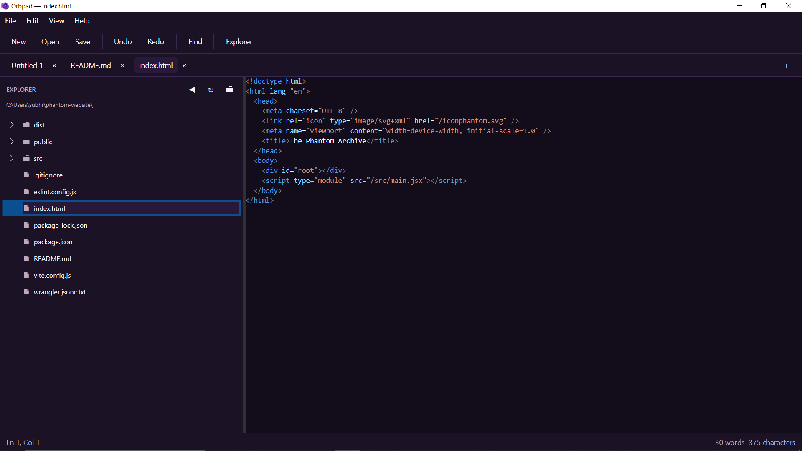
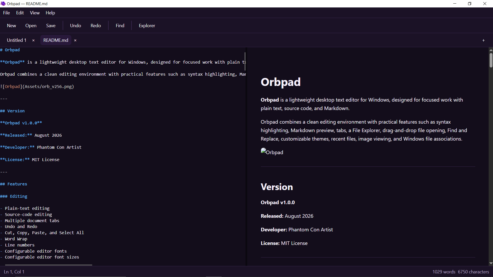

<div align="center">

  <p>
    
    &nbsp;&nbsp;&nbsp;&nbsp;
    
  </p>

  <p>
    <strong>A project under</strong>
  </p>

  <h2>The Orbis Project</h2>

  <br/>

  

  <br/><br/>

  <h1>Orbpad</h1>

  <p>
    <strong>
      A lightweight, fast, and focused desktop text editor for Windows.
    </strong>
    <br/>
    Built for plain text, source code, and Markdown.
  </p>

  <br/>

  <h3>An extension of the Orbis Ecosystem</h3>

  <p>
    Orbpad is a human-facing authoring application within the Orbis Ecosystem,
    designed to provide a focused environment for creating, editing, and
    managing information through a simple and extensible desktop workspace.
  </p>

  <br/>

</div>

[](https://github.com/Phantom-Con-Artist/Orbpad)
[](https://github.com/Phantom-Con-Artist/Orbpad/releases)
[](LICENSE)
[](https://dotnet.microsoft.com/)
[](https://avaloniaui.net/)

---

## Overview

Orbpad is a clean, distraction-free text editor for Windows. It combines the simplicity of a plain-text editor with the practical tools developers and writers actually reach for: syntax highlighting, live Markdown preview, tabs, a workspace file explorer, drag-and-drop file opening, find and replace, and a set of polished built-in themes.

Orbpad ships as a self-contained Windows x64 application — no separate .NET runtime install required.

<!-- Add a hero screenshot here once available, e.g.: -->
<!--  -->

---

## Table of Contents

- [Features](#features)
- [Screenshots](#screenshots)
- [Download](#download)
- [Installation](#installation)
- [System Requirements](#system-requirements)
- [Markdown Support](#markdown-support)
- [Keyboard Shortcuts](#keyboard-shortcuts)
- [Themes](#themes)
- [Technology](#technology)
- [Project Structure](#project-structure)
- [Documentation](#documentation)
- [Contributing](#contributing)
- [The Orbis Ecosystem](#the-orbis-ecosystem)
- [License](#license)
- [Developer](#developer)

---

## Features

### ✍️ Editing

- Plain-text and source-code editing
- Multiple document tabs
- Undo / Redo
- Cut, Copy, Paste, Select All
- Word wrap
- Line numbers
- Configurable editor font and font size

### 📝 Markdown

- Full Markdown editing
- Live Markdown preview
- Split view (edit + preview side by side)
- Rendering powered by [Markdig](https://github.com/xoofx/markdig)

### 🎨 Syntax Highlighting

Highlighting is provided via [AvaloniaEdit](https://github.com/AvaloniaUI/AvaloniaEdit) using TextMate-based grammars, covering a broad range of common file types.

### 🗂️ File Explorer

A built-in workspace File Explorer that can be:

- Resized horizontally
- Collapsed and restored on demand
- Used to open files directly within Orbpad

### 📁 File Handling

- Open via file picker or drag-and-drop
- Save and Save As
- Recent files list
- Windows "Open With" integration
- Markdown file association support
- Built-in image viewing

### 🌓 Appearance

Five polished built-in themes — see [Themes](#themes) below.

### 🖥️ Application

- Custom application icon and taskbar icon
- Branded Windows installer and uninstaller
- About Orbpad dialog

---

## Screenshots

### Editor


### File Explorer


### Markdown Preview


---

## Download

Grab the latest Windows x64 release from the [GitHub Releases](../../releases) page.

| Package | Description |
|---|---|
| `Orbpad-1.0.0-win-x64-setup.exe` | Windows installer (recommended) |
| Portable ZIP *(if provided)* | No installation required |

---

## Installation

### Windows Installer

1. Download `Orbpad-1.0.0-win-x64-setup.exe` from [Releases](../../releases).
2. Run the installer.
3. Follow the setup wizard.
4. Choose whether to create a desktop shortcut.
5. Complete the installation.
6. Launch Orbpad from the Start Menu or desktop shortcut.

An uninstall entry is registered automatically and can be accessed through Windows' installed-apps management.

### Portable Version

If a portable ZIP package is provided:

1. Extract it to a directory of your choice.
2. Run `Orbpad.exe` — no installation required.

---

## System Requirements

| Requirement | Details |
|---|---|
| OS | Windows 10 or Windows 11 |
| Architecture | x64 |
| .NET Runtime | Not required — release is self-contained |

See [`REQUIREMENTS.md`](REQUIREMENTS.md) for full details.

---

## Markdown Support

Orbpad supports three Markdown viewing modes:

| Mode | Description |
|---|---|
| **Edit** | Edit raw Markdown source |
| **Split** | Edit source and view the rendered result side by side |
| **Preview** | View fully rendered Markdown |

Markdown files can be opened directly or associated with Orbpad via Windows:

```text
test.md → Right-click → Open With → Orbpad
```

### Find and Replace

- Find / Find Next / Find Previous
- Replace / Replace All
- Case-insensitive search

### Recent Files

Accessible via **File → Recent Files**.

---

## Keyboard Shortcuts

| Action | Shortcut |
|---|---|
| New document | `Ctrl + N` |
| Open file | `Ctrl + O` |
| Save | `Ctrl + S` |
| Save As | `Ctrl + Shift + S` |
| Undo | `Ctrl + Z` |
| Redo | `Ctrl + Y` |
| Cut | `Ctrl + X` |
| Copy | `Ctrl + C` |
| Paste | `Ctrl + V` |
| Select All | `Ctrl + A` |
| Close document | `Ctrl + W` |
| Next document | `Ctrl + Tab` |
| Previous document | `Ctrl + Shift + Tab` |
| Jump to document 1–9 | `Ctrl + 1` … `Ctrl + 9` |

---

## Themes

| Theme | Description |
|---|---|
| **Orbpad Purple** *(default)* | Dark violet interface with purple accents |
| **Orbpad Dark** | Neutral dark interface, charcoal surfaces with violet accents |
| **Midnight** | Deep blue-dark interface with blue accents |
| **Forest** | Dark green interface with green accents |
| **Light** | Bright interface with a light background and purple accents |

---

## Technology

Orbpad v1.0.0 is built with:

- [.NET 10](https://dotnet.microsoft.com/)
- [Avalonia UI](https://avaloniaui.net/)
- [AvaloniaEdit](https://github.com/AvaloniaUI/AvaloniaEdit)
- [TextMate / TextMateSharp](https://github.com/danipen/TextMateSharp)
- [Markdig](https://github.com/xoofx/markdig)
- Avalonia WebView components

Distributed as a self-contained Windows x64 application.

---

## Project Structure

```text
Orbpad/
├── Assets/
│   └── Orbpad.ico
│
├── Explorer/
├── Managers/
├── Markdown/
├── Models/
├── Services/
├── Styles/
│
├── Installer/
│   └── Orbpad.iss
│
├── README.md
├── REQUIREMENTS.md
├── MANUAL.md
├── THIRD-PARTY-NOTICES.md
├── CHANGELOG.md
├── LICENSE
│
├── .gitignore
├── Orbpad.csproj
├── App.axaml
├── App.axaml.cs
├── MainWindow.axaml
├── MainWindow.axaml.cs
└── Program.cs
```

> Generated build output (`bin/`, `obj/`) is intentionally excluded from version control.

---

## Documentation

| Document | Description |
|---|---|
| [User Manual](MANUAL.md) | Full usage guide |
| [System Requirements](REQUIREMENTS.md) | Detailed platform requirements |
| [Third-Party Notices](THIRD-PARTY-NOTICES.md) | Dependency licenses |
| [Changelog](CHANGELOG.md) | Release history |
| [License](LICENSE) | MIT License text |

---

## Contributing

Issues and pull requests are welcome. If you're planning a larger change, please open an issue first to discuss what you'd like to change.

1. Fork the repository
2. Create a feature branch (`git checkout -b feature/my-feature`)
3. Commit your changes
4. Push to your branch and open a pull request

---

## The Orbis Ecosystem

Orbpad is the first application in the planned **Orbis Ecosystem**.

The long-term vision of Orbis is to provide a general-purpose structured information platform built around entities, relationships, documents, events, schemas, metadata, and time.

Rather than treating information as isolated files, Orbis is designed to make data highly connected and traversable as a graph.

### Planned Components

#### Orbis Core

The underlying foundation of the ecosystem.

Orbis Core is planned to provide:

- Entity and object models
- Schemas
- Relationships
- Temporal relationships
- Events and timelines
- Serialization and storage
- Validation
- Query and traversal capabilities

#### Orbpad

The document and authoring environment.

Planned future integration includes native support for:

```text
.entity
.bundle
.lore
.orb

## License

Orbpad is distributed under the **MIT License**.

Copyright © 2026 Phantom Con Artist.

See [`LICENSE`](LICENSE) for the full license text. Third-party dependencies remain subject to their respective licenses — see [`THIRD-PARTY-NOTICES.md`](THIRD-PARTY-NOTICES.md).

---

## Developer

**Phantom Con Artist**

Orbpad is independently developed and maintained.

<div align="center">

```text
Orbpad · v1.0.0 · Released August 2026
Windows x64 · Self-contained · MIT License
```

</div>